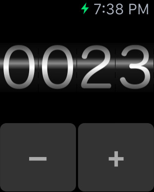
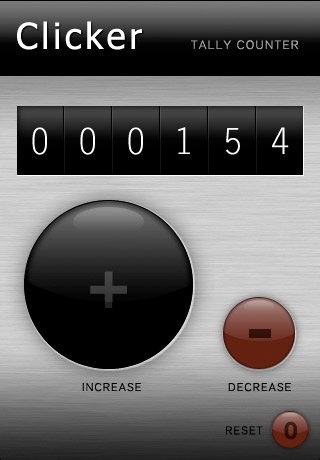
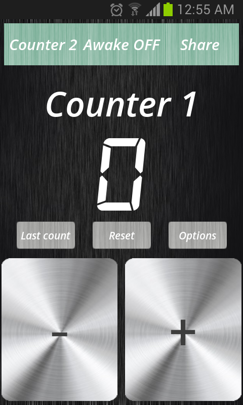
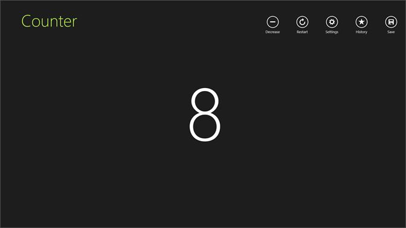

# react-counter

You are required to build a Counter App using React.  The project has already been set up for you.
* There are 3 component files in the Components directory.  Use those components as the foundation for your app.
* Be sure to familiarize yourself with the project structure of the React App.  A good starting place is "App.js" and "package.json".

Required Functionality:
* Create a working Counter App.  
* Counter should be able to increment
* Counter should be able to decrement
* Counter should be able to reset back to zero
* Counter should be styled to reflect something similar to the design files given

**Bonus Functionality : 

* Counter increments by more than one (+2,+5,+10)
* Counter can show a history of values.
* Counter animation when changing values

Below are a few design ideas.

https://scorecounter.com/click-counter/

## ********************************
## Git Instructions
- [ ] Create a template copy of this repository by clicking : "Use this template"
- [ ] Name the repository the same name as the master template repository.  
- [ ] Add your TA as collaborator
- [ ] Clone YOUR repo to your local computer
- [ ] Create a new branch: git checkout -b `<firstName-lastName>`.
- [ ] Implement the project on your newly created `<firstName-lastName>` branch, committing changes regularly.
- [ ] Push commits: git push origin `<firstName-lastName>`.
## ********************************
